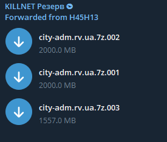

# Activity

## 2022

### Jun

#### [Attacks on few seaport](https://t.me/killnetV/168)

#### [Attack on italian maritime terminals](https://t.me/killnet\_channel/598)

### May

#### [Killmilk shows respects to Italian CSIRT after successfully mitigating attacks on the first day of Operation Panopticon](https://t.me/killnet\_channel/578)

#### [Announcing Operation Panopticon](https://t.me/killnet\_channel/572)

#### [Attack and Leak on ukrinform gov ukranian website ](https://t.me/killnet\_hacking/380)

#### [Attack and Leak on SBU Systems](https://t.me/killnet\_hacking/377)

#### [Call to attack on multiple targets](https://t.me/killnet\_hacking/356)

#### [Attack on poland gov site](https://t.me/killnet\_hacking/348)

#### [Attack on multiple data, customs, police, exploration, payment system, and poland ads sites](https://t.me/killnet\_hacking/344)

#### [Attack on multiple airports](https://t.me/killnet\_hacking/336)

#### [Attack on multiple Latvian, Estonian, Italian, Romanian, Poland and German sites](https://t.me/killnet\_hacking/328)

#### [Attack on italian police site](https://t.me/killnet\_hacking/318)

#### [Attack on Nevzorov (Mirai)](https://t.me/killnet\_hacking/307)

#### [Attack on Ziedot](https://t.me/killnet\_hacking/306)

#### [Multiple Latvia websites](https://t.me/killnet\_hacking/304)

#### [Call to fight to multiple Latvia website traffic exchange points, banks and media (Mirai)](https://t.me/killnet\_hacking/303)

#### [Call to fight to multiple Latvia website police, transport-taxi, educational institutions, gov sites (Jacky)](https://t.me/killnet\_hacking/302)

#### [Call to fight to multiple Latvia websites providers, Industry and airports (Sakurajima)](https://t.me/killnet\_hacking/301)

#### [Statement of Intent to Italy and Spain](https://t.me/killnet\_hacking/299)

#### [Eurovisión DDoS Attack](https://t.me/killnet\_hacking/294)

#### [Attack and leak on State Pension Portal of Ukraine (Zarya Legion)](https://t.me/killnet\_hacking/275)

#### [Killnet USA attack on Boeing Company](https://t.me/killnet\_hacking/271)

#### [Leak SQL Database of State Information and analytical Center of Foreign Commodity Markets of Ukraine](https://t.me/killnet\_hacking/268)

#### [Attack on Rivne City Council of Okreniya site](https://t.me/killnet\_hacking/260)

#### 

#### [Pro-Russian hackers demand the release of Ioan Feher, the Romanian accused of helping Killnet, threaten to “destroy Romania” otherwis](https://www.romaniajournal.ro/society-people/pro-russian-hackers-demand-the-release-of-ioan-feher-the-romanian-accused-of-helping-killnet-threaten-to-destroy-romania-otherwise/)

#### .png>)

#### [Attack on German info structure (Jacky)](https://t.me/killnet\_hacking/238)

#### [Attack on German info structure (Sakurajima)](https://t.me/killnet\_hacking/237)

#### [Attack on German info structure](https://t.me/killnet\_hacking/236) (Mirai)

#### [Attack on Rompetrol](https://t.me/killnet\_hacking/231)

#### [Attack on Activenews from Romania](https://t.me/killnet\_hacking/217)

#### [Attack on multiple Lithuanian](https://t.me/killnet\_hacking/212)

### Apr

#### [Attack on Social Democractic Party Site (Romanian)](https://t.me/killnet\_hacking/203)

#### [Attack on multiples critical romanian websites](https://t.me/killnet\_hacking/201)

#### [Attack on Polish Railways website](https://t.me/killnet\_hacking/196)

#### [Attack on Ukrinform](https://t.me/killnet\_hacking/191)

#### [Attack on multiples Czech critical sites](https://t.me/killnet\_hacking/186)

#### [Attack on poland gov website](https://t.me/killnet\_hacking/173)

#### [Attacks on few Estonian sites](https://t.me/killnet\_hacking/163)

#### [Attacks on multiple NATO sites](https://t.me/killnet\_hacking/160)

#### [Attack on Nukib](https://t.me/killnet\_hacking/151)

#### [Attack on multiples critical czech infraestructures](https://t.me/killnet\_hacking/140)

#### [Attacks on multiples polish airports](https://t.me/killnet\_hacking/132)

#### [Attacks on multiple airports](https://t.me/killnet\_hacking/129)

#### [Attack on bank KFW](https://t.me/killnet\_hacking/128)

#### [Attack on Commerzbank](https://t.me/killnet\_hacking/127)

#### [Attack on the official website of ONU](https://t.me/killnet\_hacking/122)

#### [Attack on Devon energy Corporation (dedicated to REvil)](https://t.me/killnet\_hacking/119)

#### [Attack on the official website of Gatwick Airport](https://t.me/killnet\_hacking/116)

#### [Attack on the official website of Bremen Airport](https://t.me/killnet\_hacking/113)

#### [Attack on the official website of Hamburg Airport](https://t.me/killnet\_hacking/112)

#### [Attack on the official website of Cologne/Bonn International Airport](https://t.me/killnet\_hacking/110)

#### [Attack on the official website of the German Ministry of Defense](https://t.me/killnet\_hacking/109)

#### [Attack on the official website of the Party of Emanuel Macrons](https://t.me/killnet\_hacking/101)

[Russia targeted Emmanuel Macron’s campaign site](https://taketonews.com/russia-targeted-emmanuel-macrons-campaign-site/)

#### The server of the Kyiv Regional Prosecutor's Office kobl.gp.gov.ua was attacked

 (1).png>)

#### [Russian hackers target Czech websites in a series of cyberattacks](https://www.expats.cz/czech-news/article/pro-russian-hackers-target-czech-websites-in-a-series-of-attacks)

Killnet named about ten attacked websites including the O2 mobile network operator and the Komerční banka, which, nevertheless, registers no such attack. O2 registered increased traffic on its servers, but the Internet services of O2 and its customers are adequately secured, said Blanka Vokounová from the O2 press section.

### Mar

#### [Killnet takes full responsibility for CYBERPOL (International Cyber Police Organization) attack](https://t.me/killnet\_hacking/77)


We know that these are not Russian hackers but a Ukrainian origin based hacking group posing as Russian Defenders calling themselves #Killnet with a makeup of Russians speaking subjects from Ukraine, Bulgaria, Australia, United Kingdom, Netherlands and USA cyber hackers funded by non-Russian speaking adversaries in the west. Further we will soon publish the Identities and Passports of the group that consist of one Female and 21 others including a notorious hacker heading the group formally wanted by the FBI in which some were turned to work unofficially for state actors” ([Cyberpol Response](https://www.cyberpol.info/2022/04/03/cyberpol-hack-press-notice-killnet/))


#### Bradley International Airport attack in response to U.S material support for Ukraine

[Killnet claimed Bradley International Airport attack](https://t.me/killnet\_hacking/70)

The distributed denial of service (DDoS) attack was an external attempt to crash the website, a CAA spokesperson said.

The CAA, which operates Bradley Airport, said it is actively monitoring the cyber attack, but that the website remains live and there is no data breach.

The incident is isolated to just the website, and there is no impact to airport operations, according to the CAA. ([NBCconnecticut](https://www.nbcconnecticut.com/news/local/bradley-airport-website-suffers-cyber-attack/2750473/))

### Feb

\[[Russia-Ukraine war](../../campaigns/russia-ukraine-war/)] Stands with Russia. The group published a [video](https://twitter.com/Cyberknow20/status/1499349570890842113) addressing the people of Russia encouraging them to never doubt their country. The video features a hooded figure with a distorted voice claiming to have taken down the website belonging to Anonymous. Little is known about the group and it is unclear as to whether the group existed previously.  ([The Record](https://therecord.media/russia-or-ukraine-hacking-groups-take-sides/?msclkid=235244a7ba6611ec92f21c9bd3b8ee49))

