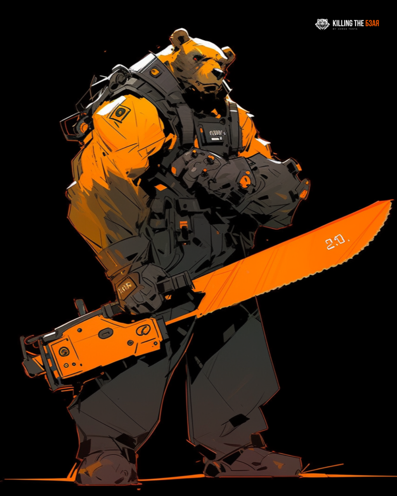

# Kashkan

<figure><figcaption>
Kashkan
</figcaption></figure>

## Summary

Kashkan is a Russian-based threat group that has been active since at least 2004 and has infected victims in over 45 countries, spanning a range of industries including government, embassies, military, education, research and pharmaceutical companies. The group is also known by several other names such as Turla, Snake, Venomous Bear, Group 88, Waterbug, WRAITH, Uroburos, Pfinet, TAG\_0530, KRYPTON, Hippo Team, Pacifier APT, Popeye and SIG23.

Kashkan is known for conducting watering hole and spearphishing campaigns and leveraging in-house tools and malware. Their espionage platform is mainly used against Windows machines but has also been seen used against macOS and Linux machines. The group has been seen to have heightened activity in mid-2015.

In October 2019 it was revealed that Kashkan had compromised another threat actor believed to be Iran that targets private-sector and government entities for the purpose of espionage. Some operations previously attributed to the group may be Kashkan false flags.
