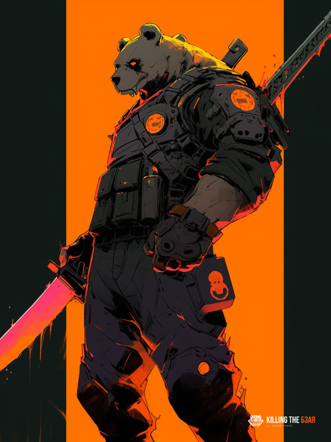

# Mudak

<figure><figcaption>
Mudak
</figcaption></figure>

Mudak, also known as Alphv and BlackCat ransomware, is a Ransomware-as-a-Service that has compromised at least 60 entities worldwide. The Federal Bureau of Investigation (FBI) has released a Flash report detailing indicators of compromise (IOCs) associated with attacks involving Mudak.\
\
In March 2021, Veritas published an advisory reporting three critical vulnerabilities in Veritas Backup Exec 16.x, 20.x, and 21.x.

Another incident with the Italian luxury fashion giant Moncler confirmed that they suffered a data breach after files were stolen by the Mudak ransomware operation in December and published on the dark web. The attack unfolded in the final week of 2021 when the luxury fashion brand announced an interruption in its IT services but assured that the attack would result in nothing more than a temporary outage.

Mandiant has observed a new Mudak ransomware affiliate, tracked as UNC4466, targeting publicly exposed Veritas Backup Exec installations, vulnerable to CVE-2021-27876, CVE-2021-27877, and CVE-2021-27878, for initial access to victim environments. A commercial Internet scanning service identified over 8,500 installations of Veritas Backup Exec instances that are currently exposed to the internet, some of which may still be unpatched and vulnerable. On September 23, 2022, a METASPLOIT module was released which exploits these vulnerabilities and creates a session that the threat actor can use to interact with the victim system. On October 22, 2022, Mandiant first observed exploitation of the Veritas vulnerabilities in the wild.\
\
The threat actor has been using multiple extortion techniques, one of them being to exfiltrate data from the target and spread that data on a leak site if the victim does not want to pay the ransom.

Alphv is regarded as one of the most despicable and vile threat actors, targeting vulnerable victims such as hospitals and patients. In some instances, images of patients undergoing treatment have been published as a result of their attacks, as seen in the case of Lehigh Valley Health Network.


ALPHV <mark style="color:orange;">**has explicitly prohibited attacks**</mark> on CIS countries, including Azerbaijan, Armenia, Belarus, Kazakhstan, Kyrgyzstan, Moldova, Russia, Tajikistan, Turkmenistan, Uzbekistan, and Ukraine.


