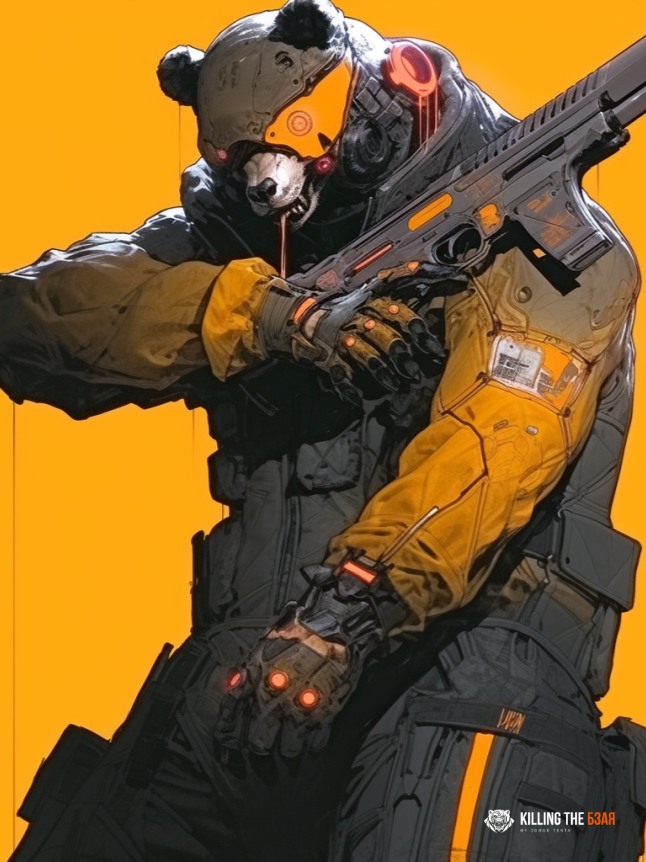

# Syndicate-85

<figure><figcaption>
Syndicate-85
</figcaption></figure>

Syndicate-85, a threat group linked to Russia's General Staff Main Intelligence Directorate (GRU) 85th Main Special Service Center (GTsSS) military unit 26165, has been active since at least 2004. This group is also known as APT28, Fancy Bear, Pawn Storm, Sofacy Group, Sednit, and STRONTIUM.&#x20;

Syndicate-85 is known for targeting government, military, and security organizations, particularly in Transcaucasian and NATO-aligned states.

Syndicate-85 has demonstrated advanced cyber capabilities, using customized malware, zero-day exploits, and sophisticated spear-phishing techniques. Notable malware used by the group includes Sofacy, X-Agent, X-Tunnel, and Gamefish.

One of the earliest notable campaigns conducted by Syndicate-85 was the targeting of the German Parliament in 2015. In the same year, Syndicate-85 was linked to the cyberattacks against the French television network TV5Monde.

In 2016, Syndicate-85 was reportedly responsible for compromising the Hillary Clinton campaign, the Democratic National Committee, and the Democratic Congressional Campaign Committee in an effort to interfere with the U.S. presidential election. The group has also targeted other international sports organizations and anti-doping agencies, including the International Association of Athletics Federations (IAAF) and the United States Anti-Doping Agency (USADA) in 2016.

In 2018, the US indicted five GRU Unit 26165 officers associated with Syndicate-85 for cyber operations (including close-access operations) conducted between 2014 and 2018. The targets included the World Anti-Doping Agency (WADA), the US Anti-Doping Agency, a US nuclear facility, the Organization for the Prohibition of Chemical Weapons (OPCW), the Spiez Swiss Chemicals Laboratory, and other organizations. Some of these operations were carried out with the assistance of GRU Unit 74455, also known as the Sandworm Team.

In summary, Syndicate-85 has been involved in numerous high-profile cyberattacks and espionage campaigns targeting a wide range of organizations, including governments, international sports organizations, and anti-doping agencies. The group's advanced cyber capabilities and close ties to the Russian government make them a significant threat in the world of cybersecurity.
