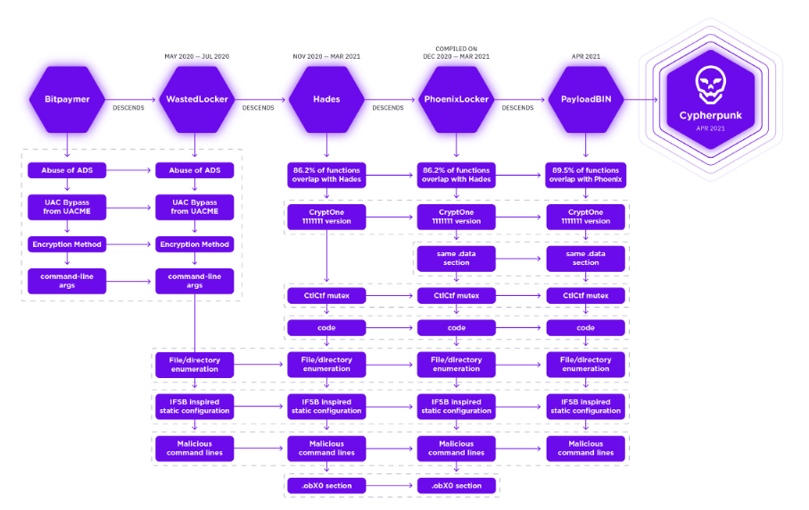

# Cooperate with

## Groups

### [XakNet](broken-reference)

According to open-source reporting, the XakNet Team threatened to target Ukrainian organizations in response to perceived DDoS or other attacks against Russia.\[[41](https://therecord.media/russia-or-ukraine-hacking-groups-take-sides/)] According to reporting from industry, on March 31, 2022, XakNet released a statement stating they would work “exclusively for the good of \[Russia].” According to industry reporting, the XakNet Team may be working with or associated with Killnet actors, who claimed credit for the DDoS attacks against a U.S. airport (see the Killnet section). ([CISA](https://www.cisa.gov/uscert/ncas/alerts/aa22-110a))

## Squads

[Squad - DDOSGUNG](https://vk.cc/cdatmL)

[Squad - Mirai](https://vk.cc/cdasVy)

[Squad - Sakurajima](https://vk.cc/cdasS6)&#x20;

[Squad - JACKY](https://vk.cc/cdavcy)

Squad - Killnet USA

Squad - Zarya (@H45H13)

Squad - Kajluk

Squad - Impulse

Squad - RAYD

## Others

DDOS training Squad Leader: @CyberEducational (Telegram)

Press: @H45H13 (Telegram)

[Cyberwar World](https://t.me/s/cyberwar\_world) (Created 26 February 2022)

[DarkRetail Channel](https://t.me/s/darkretail\_channel) (Created 10 February 2021)

[DarkRetail](https://t.me/darkretail)
